  

---

## ⚡ About Me

> **Think → Design → Build → Test → Ship → Iterate**

I'm **Dharaheshh V**, a Computer Science Engineering student focused on **backend systems, full-stack engineering, Agentic AI and problem solving**. I enjoy taking ideas from architecture to working products: APIs, databases, frontend, AI integrations, deployment and the engineering decisions between them.

### 🔭 Current Focus
- 🤖 Agentic AI — agents, LLM applications, RAG, tool use and automation
- ☕ Java + DSA — consistent placement-focused problem solving
- 🏗️ Backend & System Design — APIs, PostgreSQL, Redis, messaging and production architecture
- 🚀 DevOps — Docker, GitHub Actions, AWS and deployment workflows
- 🧠 Engineering depth — authentication, caching, retries, observability and reliability

---

## 🧰 Tech Arsenal

---

## 🚀 Featured Builds

| Project | What it does |
|---|---|
| 🌲 **[ForestWatch](https://github.com/Dharaheshh/fra-atlas-webgis)** | WebGIS forest-rights monitoring with spatial conflict detection, GeoJSON validation and AI-assisted compliance reporting. |
| 🤖 **[HireFlow AI](https://github.com/Dharaheshh/AI-powered-HR-Process-Automation)** | AI recruitment automation with resume processing, candidate matching, scheduling, AI assistance, SLA tracking and analytics. |
| 🏫 **[Smart College Damage Reporting](https://github.com/Dharaheshh/Mini-Project-I)** | Location-aware campus issue reporting with authentication, image uploads, status tracking and admin workflows. |
| 🔍 **[Repo Analyzer](https://github.com/Dharaheshh/Repo-Analyzer)** | GitHub API-based repository analysis with full-stack service architecture. |

---

## 🧠 Problem Solving

  
`Arrays` · `Hashing` · `Two Pointers` · `Sliding Window` · `Binary Search`  
`Stacks` · `Queues` · `Trees` · `Graphs` · `Backtracking` · `Dynamic Programming`

---

# 📈 GitHub Activity

<!-- These cards are generated by GitHub Actions and stored directly in this repository. -->
<!-- No Vercel stats service, activity graph service, or external image API is loaded on page view. -->

<picture>
  <source media="(prefers-color-scheme: dark)" srcset="./assets/overview.dark.svg" />
  
</picture>

  

<picture>
  <source media="(prefers-color-scheme: dark)" srcset="./assets/contributions.dark.svg" />
  
</picture>

  

<picture>
  <source media="(prefers-color-scheme: dark)" srcset="./assets/languages.dark.svg" />
  
</picture>

  

<picture>
  <source media="(prefers-color-scheme: dark)" srcset="./assets/rhythm.dark.svg" />
  
</picture>

---

## 🏆 What I'm Building Toward

`Backend Systems` · `Agentic AI` · `Java + DSA` · `System Design`  
`RAG + LLMs` · `Docker + AWS` · `CI/CD` · `Observability`

---

## 🌐 Let's Connect

  

  
### `BUILD` → `SOLVE` → `LEARN` → `SHIP` → `REPEAT` ⚡

